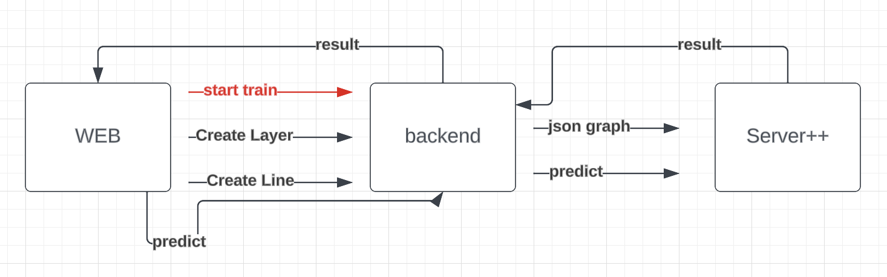

# GraphicalEditorForNN

## Technology stack

### Languages:
 - C++
 - Python
 - Javascript 
 
### DB:
 - SQLAlchemy

### Server++:
 - Makefile
  
### Server:
 - Flask
  

------------------

## Architecture

### Server++

### Overview

### Data

