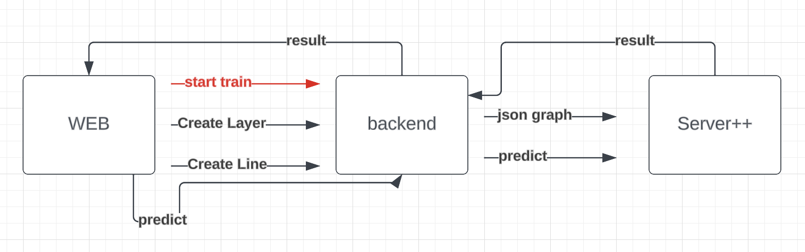
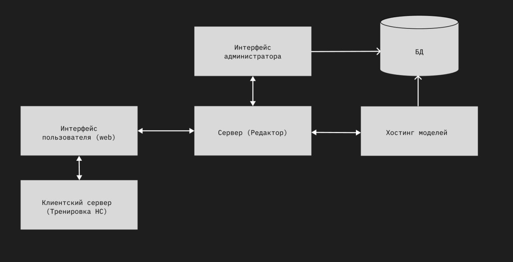
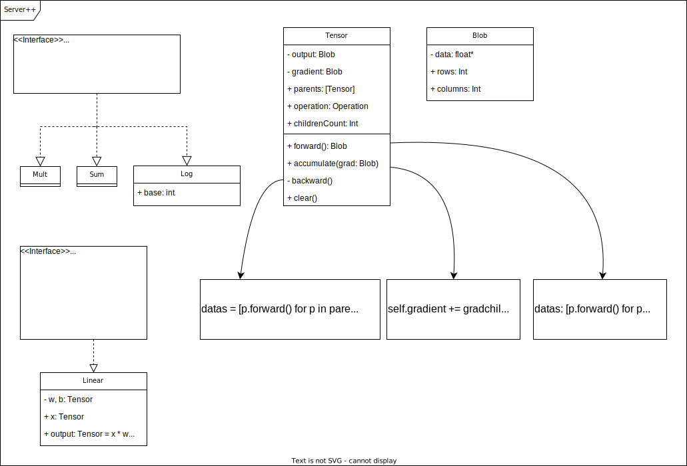
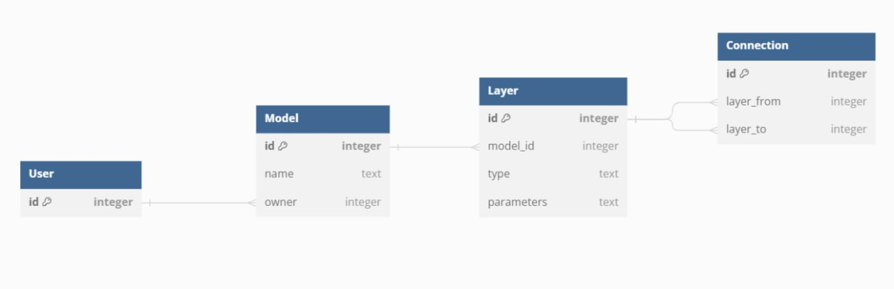

# GraphicalEditorForNN

## Build options

1. Build everything and launch in debug mode:
```
make
```
2. Build everything and launch in release mode (more optimized):
```
make release
```
This way, it will be a total mess in the terminal. Need the logging files

3. Run separately each component, for example for `py_server`:
```
cd py_server
make
```
This way, only one component will be launched

4. The same thing can be done with tests, you can either run
```
make test
```
In the root, or separately in each directory

## Formats

Some json formats to use for requests

[`Server++/train`](documentation/api-examples/train.json)  

[`Server++/predict`](documentation/api-examples/predict.json)  

[`Server/predict`](documentation/api-examples/userPredict.json)  

## Technology stack

[Figma](https://www.figma.com/file/VlSKVSf3cpgZ1pa75CTaMb/Untitled?type=design&node-id=0-1&mode=design&t=kecMaQTEdpRHFw8j-0)

[Ugile project (authorization required)](https://ru.yougile.com/team/b400e1850fe9/GraphicalEditorForNN)

### Languages:
 - C++
 - Python
 - Javascript 
 
### DB:
 - SQLAlchemy

### Server++:
 - Makefile
  
### Server:
 - Flask
  


------------------

## Architecture

### Overview


### Server++


### Data

